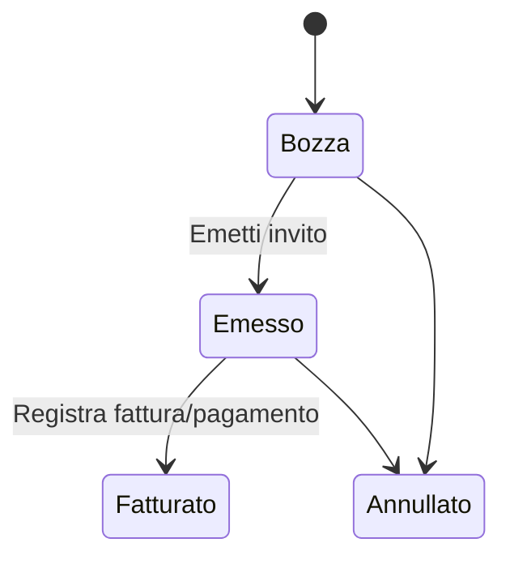

# 14 — Invito a fatturare: analisi funzionale

## Obiettivo

Gestire la **fatturazione provvigionale** verso i consulenti (venditori): raggruppare le provvigioni consolidate di un periodo in un documento amministrativo **Invito a fatturare**, con possibilità di **selezionare manualmente** quali contratti/provvigioni includere (griglia tipo report Provvigioni per tipo e venditore).

## Backup obbligatorio prima di ogni deploy

```bash
cd ~/public_html/crm/mec-group
STAMP=$(date +%Y%m%d-%H%M%S)
mkdir -p "backup_dev/InvitoAFatturare/deploy-${STAMP}"
cp -a custom/Espo/Custom/Services/InvitoAFatturareManager.php \
      custom/Espo/Custom/Controllers/InvitoAFatturare.php \
      custom/Espo/Custom/Hooks/InvitoAFatturare/ \
      custom/Espo/Custom/Actions/InvitoAFatturare/ \
      custom/Espo/Custom/Resources/metadata/entityDefs/InvitoAFatturare.json \
      custom/Espo/Custom/Resources/metadata/clientDefs/InvitoAFatturare.json \
      client/custom/src/views/invito-a-fatturare/ \
      "backup_dev/InvitoAFatturare/deploy-${STAMP}/" 2>/dev/null || true
echo "Backup in backup_dev/InvitoAFatturare/deploy-${STAMP}"
```

Oppure: `bash tools/deploy-invito-a-fatturare.sh` (include backup automatico).

---

## Entità principale: `InvitoAFatturare`

| Campo | Tipo | Ruolo |
|-------|------|-------|
| `name` | varchar | Titolo (es. INV-202607-abc123) |
| `numero` | varchar | Numero progressivo invito |
| `stato` | enum | `Bozza` → `Emesso` → `Fatturato` → `Annullato` |
| `meseCompetenza` | date | Primo giorno del mese di competenza |
| `dataInvito` | date | Data emissione (auto su Emesso) |
| `dataScadenzaFatturazione` | date | Scadenza per il consulente |
| `consulente` | link User | Venditore destinatario fattura |
| `fornitorePartner` | link | Filtro partner (opzionale) |
| `productBrand` | link | Filtro brand (opzionale) |
| `importoTotaleConsolidato` | currency RO | Somma `importoConsolidato` provvigioni incluse |
| `importoTotalePrevisto` | currency RO | Somma forecast |
| `scostamentoTotale` | currency RO | Consolidato − previsto |
| `pagamentoProvvigionale` | link | Collegamento al pagamento effettivo |
| `description` | text | Note |

### Stati amministrativi



| Transizione | Effetto sulle provvigioni collegate |
|-------------|-------------------------------------|
| → **Emesso** | `statoProvvigione` = `InInvito` |
| → **Fatturato** | `statoProvvigione` = `Fatturata`, `dataLiquidazioneEffettiva` |
| Unlink in Bozza | Resta `Consolidata`, `invitoAFatturareId` = null |

---

## Relazioni

```
User (consulente) ──1:N──► InvitoAFatturare ──1:N──► Provvigione
                                    │
                                    └──► PagamentiProvvigionali (opzionale)

Provvigione ──N:1──► Quote (contratto)
Provvigione ──N:1──► Account (cliente)
Provvigione ──N:1──► Opportunity
Provvigione ──N:1──► Appuntamento
```

**Cardinalità:** un invito contiene molte provvigioni; ogni provvigione può stare in **un solo** invito (`invitoAFatturareId`).

---

## Entità collegata: `Provvigione`

Campi rilevanti per l'invito (base + custom in repo):

| Campo | Uso nell'invito |
|-------|-----------------|
| `tipo` | Raggruppamento UI (Provvigione Base, Plus Provvigionale, …) |
| `statoProvvigione` | `Consolidata` = eleggibile; `InInvito` / `Fatturata` = già in ciclo |
| `importoConsolidato` | **Provv. in pagamento** (colonna “Provv In Pag” del report) |
| `importoPrevisto` | Forecast |
| `importo` | Legacy, fallback se consolidato assente |
| `tassoProvvigioni` | **Perc. provv.** |
| `contratto` / `contrattoId` | Link al Contratto (Quote) |
| `cliente` / `clienteId` | Cliente |
| `assignedUser` | **Venditore** (raggruppamento secondario) |
| `dataCompetenza` | Filtro periodo |
| `dataLiquidazionePrevista` | Filtro periodo (priorità su competenza) |
| `invitoAFatturare` | FK verso invito |

### Mapping colonne report → CRM

| Colonna report (immagine) | Fonte dati |
|---------------------------|------------|
| Tipo Provv | `Provvigione.tipo` |
| Venditore | `Provvigione.assignedUserName` |
| Data Vendita | `Quote.dateOrdered` o `dataInstallazione` |
| CLIENTE | `Quote.accountName` / `Provvigione.clienteName` |
| STATO | `Quote.statoContratto` |
| Prezzo Vend. | `Quote.importoContratto` o `amount` |
| Aliquot | `Quote.aliquotaIVA` o `taxRate` |
| Imponibile | `Quote.prezzoListinoIvaEsclusa` |
| MinusPlus | `Quote.minusPlus` |
| PercProv | `Provvigione.tassoProvvigioni` |
| Provv Già Pag | Provvigioni `Fatturata` o somma `PagamentiProvvigionali` |
| Provv In Pag | `importoConsolidato` se `Consolidata` / incluse in invito |
| Articoli Portale | Nome contratto / prodotti collegati |

---

## Regole di eleggibilità

Una provvigione è **selezionabile** se:

1. `statoProvvigione` = `Consolidata` **oppure** già collegata all'invito corrente (Bozza)
2. `invitoAFatturareId` è `null` **oppure** = id invito in modifica
3. `assignedUserId` = `consulente` dell'invito
4. (Opz.) `fornitorePartnerId` / `productBrandId` coincidono con filtri invito
5. `dataLiquidazionePrevista` o `dataCompetenza` nel mese `meseCompetenza`

L'invito deve essere in stato **Bozza** per modificare la selezione.

---

## Flussi operativi

### A) Selezione manuale (nuovo — come report)

1. Crea invito Bozza: consulente + mese competenza (+ filtri partner/brand)
2. Pulsante **Seleziona provvigioni** → griglia raggruppata per tipo e venditore
3. Checkbox per riga; conferma → API `collegaProvvigioni`
4. Totali ricalcolati automaticamente (hook `BeforeSave`)

### B) Generazione automatica (esistente)

1. Pulsante **Genera da provvigioni** → tutte le eleggibili del mese vengono collegate
2. Utile come scorciatoia; la selezione manuale resta prioritaria per eccezioni

### C) Emissione

1. **Emetti invito** → stato `Emesso`, provvigioni → `InInvito`
2. Export / invio al consulente (fase successiva)

### D) Chiusura

1. Stato `Fatturato` + eventuale link `pagamentoProvvigionale`
2. Provvigioni → `Fatturata`

---

## File modulo (repo)

| Componente | Path |
|------------|------|
| entityDefs | `custom/Espo/Custom/Resources/metadata/entityDefs/InvitoAFatturare.json` |
| clientDefs | `custom/Espo/Custom/Resources/metadata/clientDefs/InvitoAFatturare.json` |
| scope | `custom/Espo/Custom/Resources/metadata/scopes/InvitoAFatturare.json` |
| Service | `custom/Espo/Custom/Services/InvitoAFatturareManager.php` |
| Controller | `custom/Espo/Custom/Controllers/InvitoAFatturare.php` |
| Hook | `custom/Espo/Custom/Hooks/InvitoAFatturare/BeforeSave.php` |
| Actions | `custom/Espo/Custom/Actions/InvitoAFatturare/` |
| UI detail | `client/custom/src/views/invito-a-fatturare/record/detail.js` |
| UI selezione | `client/custom/src/views/invito-a-fatturare/modals/select-provvigioni.js` |
| SQL storico | `database/2026-05-24-invito-fatturare-provvigioni.sql` |
| Deploy | `tools/deploy-invito-a-fatturare.sh` |

---

## API custom

| Action | Metodo | Parametri |
|--------|--------|-----------|
| `getProvvigioniEleggibili` | GET/POST | `consulenteId`, `meseCompetenza`, `fornitorePartnerId?`, `productBrandId?`, `invitoId?` |
| `collegaProvvigioni` | POST | `invitoId`, `provvigioneIds[]` |
| `generaDaProvvigioni` | POST | (esistente) auto-collega tutte |
| `emetti` | POST | `id` |

---

## Non regressione

- **Non mescolare** deploy con KPI, layout Contratto o Provvigioni Manager
- Scope modulo: solo file `InvitoAFatturare`, `Provvigione.invitoAFatturare*`, client `invito-a-fatturare/`
- i18n: solo **aggiunte** in `it_IT/InvitoAFatturare.json`

---

## Fasi successive (non in questo PR)

- Numerazione progressiva `numero` automatica
- Export PDF / Excel invito
- Integrazione contabilità / pagamento massivo
- Report Provvigioni standalone con stessa griglia
